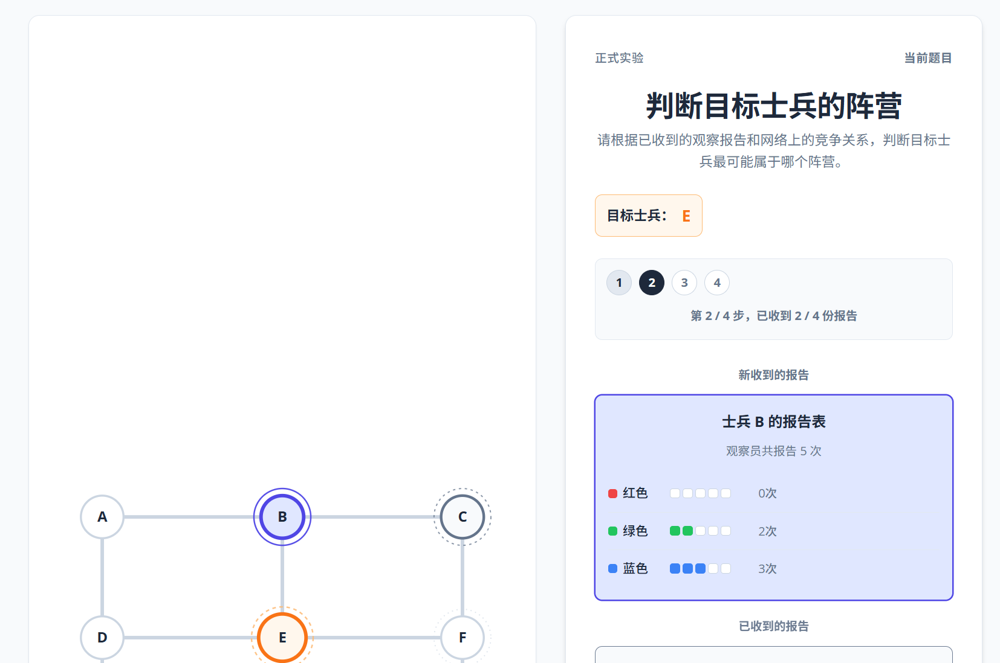

# Practice Instructions and Copy Spec

更新时间：2026-06-03

适用范围：`experiment_frontend/` 练习阶段 0A / 0B / 0C 的被试可见文案。

本文档只定义实验指引、trial 内提示和反馈文案，不定义布局和代码实现。视觉与交互要求见：

```text
experiment_frontend/docs/PRACTICE_STAGE_VISUAL_SPEC.md
```

## 1. 文案目标

练习阶段的文案要同时满足三点：

1. 有情景代入感：被试能理解自己在“战场观察报告”任务中扮演什么角色。
2. 清楚可执行：每个阶段都明确告诉被试当前要看什么、判断什么、是否会反馈。
3. 不误导：报告频率不是士兵真实身份，报告多数也不等于正确答案；图上连线表示不能同阵营。

所有被试看得到的文案必须使用简体中文。

## 2. 核心术语

后续界面统一使用以下词：

```text
圆点 / 士兵
阵营
红色 / 绿色 / 蓝色
连线
竞争关系
观察报告
报告表
目标士兵
信心
提交
下一题
```

不建议在被试界面使用：

```text
节点
图
约束
证据节点
cue
posterior
trial
phase
block
mask
```

如果界面空间有限，“目标士兵”可以简写为“目标”。

## 3. 总指导语

总指导语出现在实验开始后、练习阶段开始前。建议分屏呈现，不要一次性堆满整页。

### 3.1 总说明第 1 页：世界设定

标题：

```text
任务背景
```

正文：

```text
这是一个战场世界。

每一轮中，网络里的每个圆点代表一名士兵。每名士兵都属于三个阵营之一：红色、绿色或蓝色。

有连线的两名士兵存在直接竞争关系，因此他们不能属于同一阵营。
```

按钮：

```text
继续
```

### 3.2 总说明第 2 页：观察报告

标题：

```text
你能看到什么
```

正文：

```text
你是观察员的报告书记。

你无法直接看到任何士兵的真实阵营，只能看到观察员对部分士兵留下的报告。

由于战场信号受到扰动，观察距离也比较远，每次观察报告不一定准确。观察员每次报告正确的概率约为七成。
```

按钮：

```text
继续
```

### 3.3 总说明第 3 页：报告表

标题：

```text
如何阅读报告表
```

正文：

```text
报告表记录的是观察员对同一名士兵进行多次观察后留下的结果。

例如，某名士兵的报告表显示：

红色 0 次，绿色 3 次，蓝色 2 次

这表示观察员一共观察了五次，其中三次报告他像绿色阵营，两次报告他像蓝色阵营，没有报告他像红色阵营。

报告次数越多，通常越有参考价值；但报告不是士兵的真实身份。
```

按钮：

```text
继续
```

### 3.4 总说明第 4 页：你的任务

标题：

```text
你的任务
```

正文：

```text
每一题中，系统会标出一名目标士兵。

请根据网络上的竞争关系和观察报告，判断目标士兵最可能属于哪个阵营。

作答时，请先选择红色、绿色或蓝色，再报告你对判断的信心，最后点击提交。
```

按钮：

```text
开始练习
```

## 4. 练习阶段总结构

练习阶段分三部分：

```text
0A：学习报告表
0B：无反馈判断
0C：结合竞争关系
```

界面上可以显示为：

```text
练习一：学习报告表
练习二：无反馈判断
练习三：结合竞争关系
```

不要显示 `0A`、`0B`、`0C` 给被试。

## 5. 练习一：学习报告表

对应数据阶段：`practice_learning`

目的：让被试理解单名士兵的报告表怎样使用，并知道报告有噪声。

### 5.1 阶段开始页

标题：

```text
练习一：学习报告表
```

正文：

```text
在这一部分，你只需要根据一名士兵自己的报告表，判断他最可能属于哪个阵营。

每题作答后，你会看到正确答案。

请注意：观察报告通常有帮助，但并不总是正确。观察员每次报告正确的概率约为七成。
```

按钮：

```text
开始练习一
```

### 5.2 Trial 内提示

标题区域：

```text
判断目标士兵的阵营
```

目标提示：

```text
目标士兵：B
```

说明句：

```text
请查看这名士兵的报告表，判断他最可能属于哪个阵营。
```

作答区：

```text
选择阵营
信心
提交
```

### 5.3 反馈：回答正确

标题：

```text
回答正确
```

正文模板：

```text
目标士兵 B 的真实阵营是红色。

这次你的判断和真实阵营一致。
```

按钮：

```text
下一题
```

### 5.4 反馈：回答错误，多数报告正确

标题：

```text
回答错误
```

正文模板：

```text
目标士兵 B 的真实阵营是红色。

这一次，报告表中红色报告最多。报告次数多的颜色通常更有参考价值。
```

按钮：

```text
下一题
```

### 5.5 反馈：回答错误，多数报告不等于真实阵营

标题：

```text
回答错误
```

正文模板：

```text
目标士兵 D 的真实阵营是红色。

这一次，报告最多的颜色并不是真实阵营。观察报告通常有帮助，但不是确定答案。
```

按钮：

```text
下一题
```

### 5.6 反馈：回答正确，但多数报告不等于真实阵营

标题：

```text
回答正确
```

正文模板：

```text
目标士兵 D 的真实阵营是红色。

这一次，报告最多的颜色并不是真实阵营。你的判断没有只依赖报告最多的颜色。
```

按钮：

```text
下一题
```

实现注意：如果当前数据没有足够字段判断多数报告是否等于真实阵营，可以先使用通用反馈：

```text
目标士兵 D 的真实阵营是红色。

观察报告通常有帮助，但不是确定答案。
```

不要编造不存在的解释。

## 6. 练习二：无反馈判断

对应数据阶段：`practice_calibration`

目的：观察被试在无反馈时如何使用报告表，并记录其对三种阵营可能性的完整排序。

### 6.1 阶段开始页

标题：

```text
练习二：无反馈判断
```

正文：

```text
在这一部分，你仍然需要根据目标士兵自己的报告表，判断他可能属于哪个阵营。

这一部分不会显示正确答案。请按照你的真实判断，把红色、绿色、蓝色三个阵营从“最可能”到“最不可能”排序，并分别报告信心。
```

按钮：

```text
开始练习二
```

### 6.2 Trial 内提示

标题区域：

```text
判断目标士兵的阵营
```

目标提示：

```text
目标士兵：C
```

说明句：

```text
请查看这名士兵的报告表，把三个阵营按可能性排序，并分别报告信心。本部分不会显示反馈。
```

作答区：

```text
第一选择：最可能的阵营
第二选择：次可能的阵营
第三选择：剩余的阵营
每个选择分别报告信心
提交
```

### 6.3 提交后

提交后直接进入下一题，或短暂显示：

```text
已记录
```

如果显示“已记录”，停留时间不应超过 500 ms，且不得显示正确/错误或真实阵营。

0B response 至少应记录：

```text
rank1_color
rank1_confidence
rank2_color
rank2_confidence
rank3_color
rank3_confidence
```

为兼容通用字段，`response_color` 和 `confidence` 可分别等于 `rank1_color` 与 `rank1_confidence`，但分析 0B 时应优先使用 rank 字段。

## 7. 练习三：结合竞争关系

对应数据阶段：`practice_integration`

目的：让被试理解：报告表给出的是其他士兵的可能阵营，而连线会影响目标士兵的可能阵营。

### 7.1 阶段开始页

标题：

```text
练习三：结合竞争关系
```

正文：

```text
在这一部分，你需要同时使用两类信息：

第一，观察员对部分士兵留下的报告表。

第二，网络中的连线。两名有连线的士兵存在直接竞争关系，不能属于同一阵营。

请根据这些信息，判断目标士兵最可能属于哪个阵营。每题作答后，你会看到简短反馈。
```

按钮：

```text
开始练习三
```

### 7.2 Trial 内提示

标题区域：

```text
结合报告和竞争关系
```

目标提示：

```text
目标士兵：E
```

说明句：

```text
请查看其他士兵的报告表，并结合连线关系，判断目标士兵最可能属于哪个阵营。
```

如果只有一个被报告士兵：

```text
当前报告来自士兵 B。注意 B 与目标士兵 E 是否有连线。
```

如果有多个被报告士兵：

```text
当前报告来自多名士兵。请同时考虑他们的报告和连线关系。
```

### 7.3 反馈通用结构

标题：

```text
本题反馈
```

正文结构：

```text
目标士兵 E 的真实阵营是红色。

[使用当前 trial 的反馈说明。]
```

按钮：

```text
下一题
```

### 7.4 使用现有 feedback_text

当前 `practice_integration` 数据中已有 `metadata.feedback_text`，可以作为主要反馈来源，但实现时要做两点处理：

1. 去掉开头重复的“反馈：”。
2. 保持原意，不自行扩写成复杂策略说明。

例如原文：

```text
反馈：目标士兵 E 的真实阵营是红。B 的报告多数为红，但报告不是确定身份；这次 B 实际是绿。因为 E 与 B 相连，E 不能和 B 同阵营，所以 E 可以是红。
```

界面显示建议：

```text
目标士兵 E 的真实阵营是红色。

B 的报告多数为红色，但报告不是确定身份；这次 B 实际是绿色。因为 E 与 B 相连，E 不能和 B 同阵营，所以 E 可以是红色。
```

注意：如果数据里已经包含“目标士兵 E 的真实阵营是红”，实现时避免重复显示两遍。

## 8. 报告表文案

报告表标题：

```text
士兵 B 的报告表
```

0A 和 0B 中，报告表属于目标士兵本人时，可以写成：

```text
目标士兵 B 的报告表
```

0C 中，报告表通常属于其他士兵，必须避免写成目标士兵的报告表：

```text
士兵 B 的报告表
```

报告条格式：

```text
红色    ■ ■ ■ ■ □    4 / 5
绿色    ■ □ □ □ □    1 / 5
蓝色    □ □ □ □ □    0 / 5
```

表格旁边可以有短提示：

```text
每一格代表一次观察报告。
```

呈现规则：

1. 固定红色、绿色、蓝色三行顺序。
2. 每行固定显示 5 个离散报告格。
3. 右侧显示次数，例如 `4 次` 或 `4 / 5`。
4. 0 次也完整显示为空格。
5. 不按次数排序。
6. 不自动标出报告最多的颜色。
7. 不显示“推荐”“更可能”“正确”等解释性标签。
8. 多名士兵的报告表必须分开显示。

不建议写：

```text
红色概率 80%
```

原因：这些是观察报告计数，不是目标颜色的后验概率，也不是真实阵营概率。

## 9. 作答区文案

颜色选择标题：

```text
你认为目标士兵最可能属于哪个阵营？
```

按钮：

```text
红色
绿色
蓝色
```

信心标题：

```text
你对这个判断有多大信心？
```

信心刻度：

```text
不确定
比较确定
非常确定
```

提交按钮：

```text
提交
```

未选颜色时提交按钮禁用。若需要提示：

```text
请先选择一个阵营
```

## 10. 进度文案

练习一：

```text
练习一：学习报告表
第 1 / 6 题
```

练习二：

```text
练习二：无反馈判断
第 1 / 8 题
```

练习三：

```text
练习三：结合竞争关系
第 1 / 4 题
```

不要显示：

```text
practice_learning
practice_calibration
practice_integration
0A_L01
trial_id
```

## 11. 简洁版总指导语

如果实现时暂时只能放一页总指导语，使用以下版本：

```text
这是一个战场世界。每个圆点代表一名士兵，每名士兵属于红色、绿色或蓝色三个阵营之一。

有连线的两名士兵存在直接竞争关系，因此不能属于同一阵营。

你是观察员的报告书记，无法直接看到任何士兵的真实阵营，只能看到观察员对部分士兵留下的报告。由于战场信号受到扰动，每次观察报告不一定准确；观察员每次报告正确的概率约为七成。

报告表记录的是观察员对同一名士兵进行多次观察后留下的结果。例如，“红色 0 次、绿色 3 次、蓝色 2 次”表示观察员一共观察五次，其中三次报告他像绿色阵营，两次报告他像蓝色阵营。报告次数越多通常越有参考价值，但报告不是士兵的真实身份。

请根据网络上的竞争关系和观察报告，判断目标士兵最可能属于哪个阵营。
```

## 12. 审查清单

后续实现完成后，审查时至少检查：

1. 总指导语是否解释了士兵、阵营、连线、观察报告和报告表。
2. 0A 是否明确告诉被试会有反馈。
3. 0B 是否明确告诉被试不会有反馈。
4. 0C 是否明确告诉被试要结合连线竞争关系。
5. 0A 是否真的显示反馈。
6. 0B 是否没有正确/错误反馈。
7. 0C 反馈是否强调竞争关系，而不是只讲报告多数。
8. 报告表是否显示为观察报告计数，而不是概率。
9. 被试界面是否没有暴露工程字段。
10. 所有被试看得到的文案是否为简体中文。
